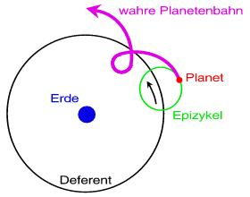
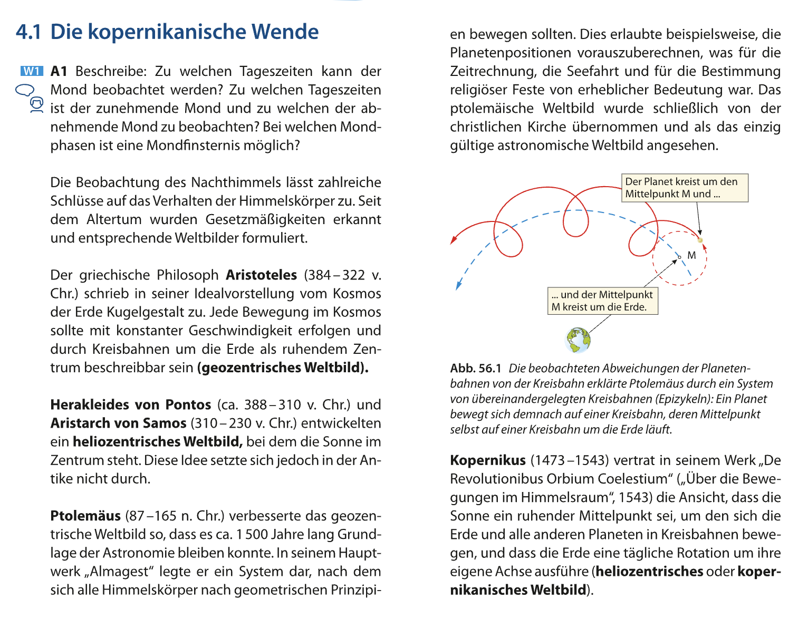

_~100 AD._

Astronom in Alexandria, Vertreter des geozentrisches Weltbildes  
genaue Planetenbeobachtungen (zeichnet welche Bahnen die Planeten haben)  
**Planeten - Ort**
Verschiedene Zeiten - Verschieden Planeten  
Viele Punkten werden verbunden und zur **Planeten Bahn**

Fokus auf **Mars** (zu welcher Zeit ist der Mars wo?) -> ::**Rückläufige Bahne**::

**Ad Hoc Hypothese**
_(ist eine Annahme, um eine Aussage zu stürzen)_

## Erklärung nach Ptolemaios _(nur Behauptung)_

**Epizykel**: epi (auf) + zykel (Kreis) -> auf Kreis  
_In der Zentrum des Epizykels ist **KEINE** Masse, nur ein mathematisches Punkt_

Aesthetisch & theoretisch unbefriedigend, es liefert keine Erklärung,  
hat aber ::Perfekt:: funktioniert -> Daher hats sich diese Theorie so lange gehalten

Es war wichtig für Seefahrt, Navigation, Bestimmung religiöse Feste (Ostern), Zeitmessung etc.

  
Basiswissen 5 s56/4.1a

