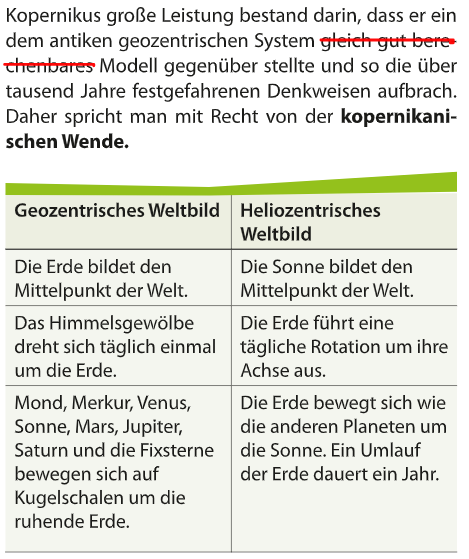

_1473-1543_

## kopernikanische Wende

==**Heliozentrisches Weltbild**== (Sonne steht in die Mitte)

**Sonne**: ruht, kugelförmig, zentrum des alles
**Kugelförmig** Planeten umkreist die Sonne in **Kreisbahnen**:

1. Merkur
2. Venus
3. Erde (dreht um seine Achse in 24h -> Tag und Nacht)  
   _Mond (kreist um die Erde, epizyklische Bewegung um Erde von sicht der Sonne)_
4. Mars
5. Jupiter
6. Saturn
7. Fixsternsphäre

## Kopernikus Vorsichtesmaßnahmen

1. In schwierige ==Mathematische Sprache== geschrieben
2. Gibt den ==Druckerlaubnis== kurz bevor sein Tod
3. ==Hypothetisch== argumentiert (Apodiktisch: Es ist so / Hypothetisch: ich kann annehmen dass)

Kopernikus war sehr vorsichtig -> schreibt ein Buch über bewegung der Planeten in Mathematischen Form (nur für Mathematiker lesbar, die mönche konnte es nicht verstehen)  
1543 eröffentlicht er das Buch als er starb _(Druckerlaubnis)_

  
Basiswissen 5 s57/4.1

  

