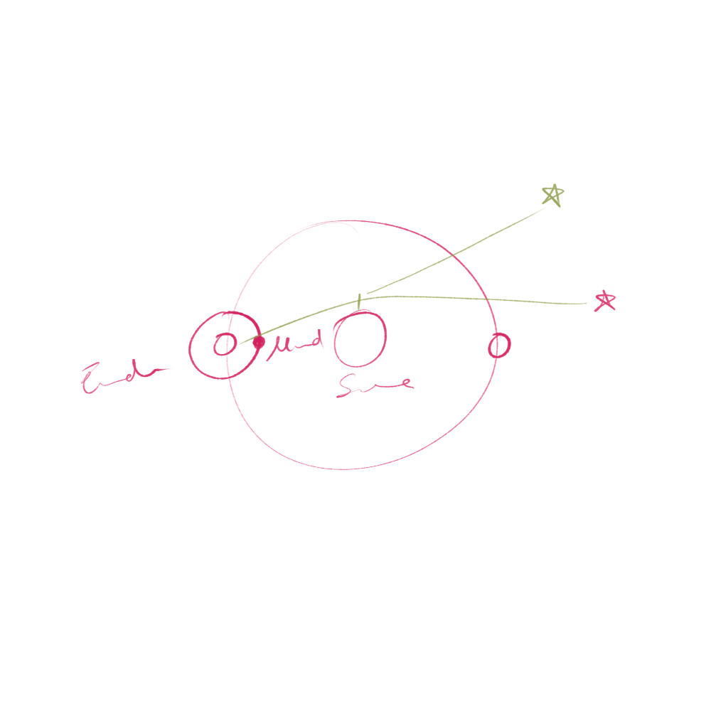
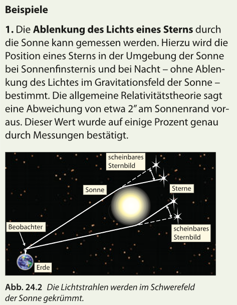
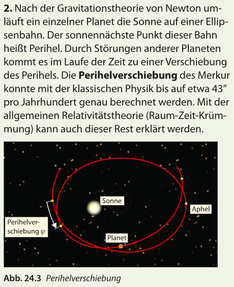
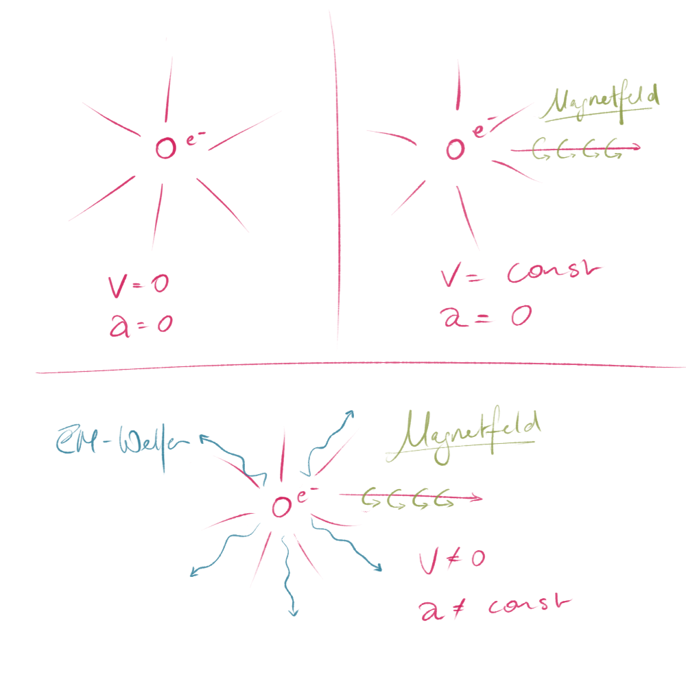

aRT = Allgemeine Relativitätstheorie

==aRT (1915) behandelt beschleunigte Systeme==  
==sRT (1905) behandelt unbeschleunigte Systeme== _(Beschleunigung = 0)_

Logischer Zusammenhang:

$$
sRT \subset aRT
$$

_sRT ist eine Teilmenge der aRT._

## Effekte der aRT

### **Lichtablenkung im Gravitationsfeld**

Erste Messung der Lichtablenkung im Gravitationsfeld der Sonne durch **Arthur Eddington**  
 (1919, Westafrika).

Während einer Sonnenfinsternis beobachtete er die Sterne (am Tag) und vergleichte die scheinbaren Positionen  
 $\rightarrow$ die Sterne erscheinen ==weiter vom Sonnen entfernt==.  
 Das Licht wird ==nach außen== gekrümmt.

 

basiswissen 8 s24/21.8a

### **Periheldrehung des Merkur**

**Perihel**: sonnennächster Punkt einer Ellipsenbahn  
 _(per: nah, hel: Sonne / Himmel)_

Die Planetenbahn ändert sich – wieso?  
 $\rightarrow$ Es scheint eine andere Kraft zu wirken  
 (z.B. Gravitation eines anderen Planeten „Vulkan“ – existiert nicht).

**Sehr kurze Erklärung**:  
 Nach der Formel $E = mc^2$ kann man dem Gravitationsfeld der Sonne eine Masse zuschreiben.  
 Diese sehr sehr kleine Masse wirkt ebenfalls durch ihre Gravitation auf die Merkurbahn _(und auch auf andere Planeten. Merkur am stärksten weil er der Sonne am nächsten ist)_ und führt zu dieser Drehung des Perihels.

basiswissen 8 s24/21.8b

### **Gravitationswelle**:

1860 entdeckte Maxwell elektromagnetische Wellen  
 _(sichtbares Licht, Handysignale, Mikrowellen, Infrarot, UV usw.)_,  
 1915 von Einstein vorhergesagt,  
 2015 wurden Gravitationswellen entdeckt.

**Elektron ruht**:  
 $v = 0$, ==Es erzeugt ein elektrisches Feld==.

**Elektron bewegt sich mit konstanter Geschwindigkeit**:  
 $v = \text{const}$, ==Es erzeugt ein elektrisches und ein magnetisches Feld==.

**Elektron beschleunigt**:  
 $v \neq \text{const} \land a \neq \text{const}$, ==Es erzeugt ein elektrisches Feld, ein magnetisches Feld und sendet EM-Wellen aus==.

Maxwell: Beschleunigte Ladungen senden elektromagnetische Wellen aus.  
 $\rightarrow$ Analogieschluss _(Vergleichsschluss)_:  
 **Beschleunigte Massen senden Gravitationswellen aus.**

Wobei $\mathrm{F_{EM}/F_G} \approx 10^{40}$ _(Gravitation ist eine sehr schwache Kraft)_, daher beobachten wir nur Schwarze Löcher, Neutronensterne, etc.

