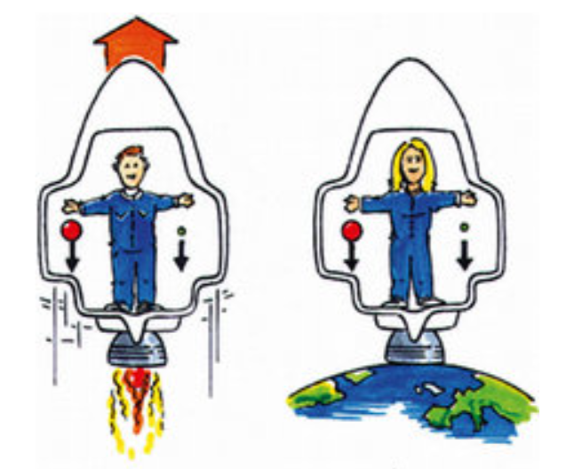
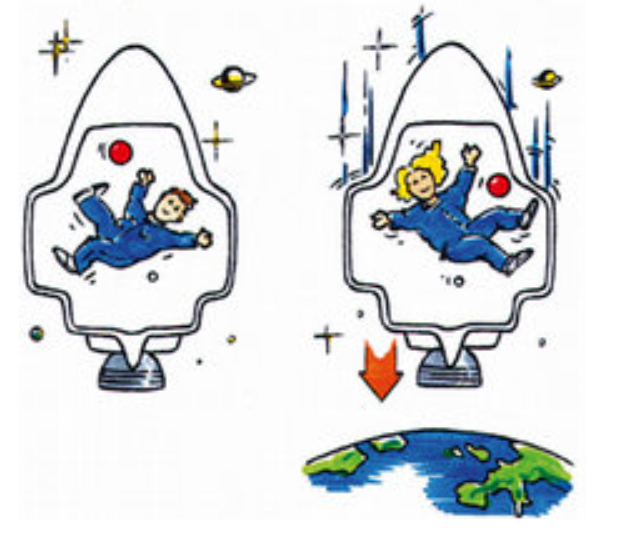

==Äquivalenzprinzip gehört zur aRT.==  
"Äquivalent" = Gleichwertigkeit

## Gedankenexperiment 1

Gravitationsfeld & Beschleunigung:

- Raumschiff A: steht still auf der Erdoberfläche, es wirkt Erdbeschleunigung  
  $g = 9{,}81 \,\mathrm{m/s^2}$  
  _Antrieb deaktiviert_

- Raumschiff B: fliegt im Weltraum mit der Beschleunigung  
  $a = 9{,}81 \,\mathrm{m/s^2}$  
  _Antrieb aktiviert_

  

## Gedankenexperiment 2

Schwerelosigkeit:

- Raumschiff A: schwebt im Weltraum (weit entfernt von Planeten, Gravitation  
  $F_G \approx 0$), mit der Beschleunigung  
  $a = 0 \,\mathrm{m/s^2}$  
  _keine Beschleunigung_ und Geschwindigkeit  
  $v = \text{const}$  
  **keine Schwerkraft**

- Raumschiff B: befindet sich im freien Fall (ohne Luftreibung)  
  **nur Schwerkraft**

  
---

Diese Szenen sind **äquivalent** $\rightarrow$  
==Man kann durch kein Experiment feststellen, ob man auf der Erde steht oder im Weltraum beschleunigt wird.==
