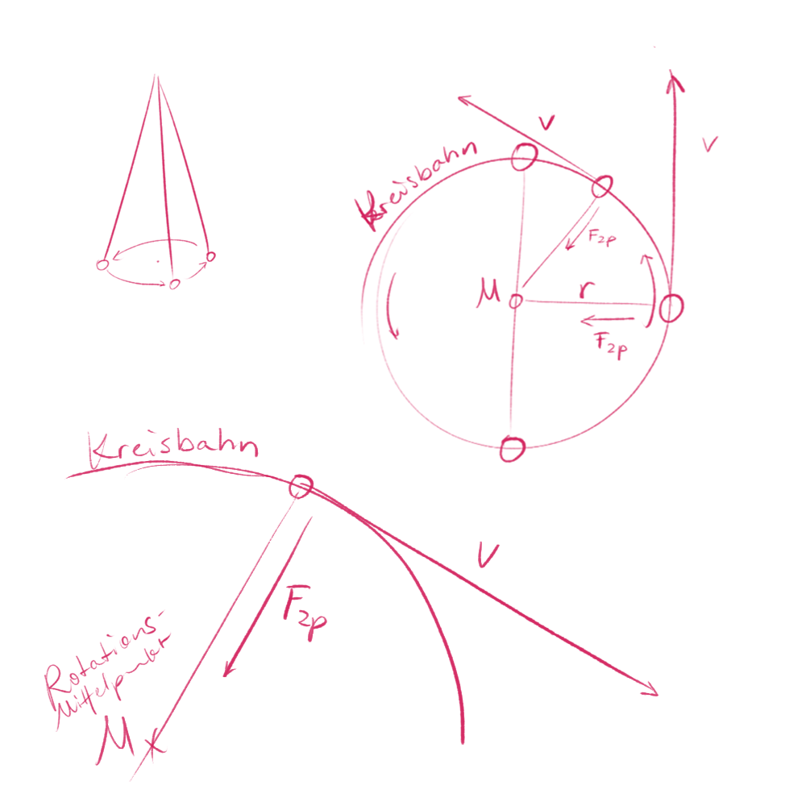

*(To be supplemented)*

**Zentripetalkraft** ist die Kraft die man braucht dass ein Körper auf ein Kreis/Ellipsen Bahn bleibt.  
**Zentrifugalkraft** ist kein Kraft sondern ein Trägheitseffekt _(Scheinkraft)_.

Ein Körper die Beschleunigt ist, ist ein Körper die sich bewegt.

==Geschwindigkeit ist ein Vektor $\vec{v}$ (mit Richtung)==.  
==Immer wenn die Richtung sich ändert wird es beschleunigt==.  

==**Beschleunigte Bewegung** Damit ein Körper beschleunigt wird, muss es darauf Kraft wirken==.  

==Weil wir für jede Rotation (Richtungsänderung) da es sich um ein beschleunigte Bewegung handelt, ein Kraft nötig ist, hat diese Kraft eine eigene Name bekommen: Zentripetalkraft $F_{zp}$==, eine zum Zentrum hin gerichtete Kraft.

Formale Menge, von der Gravitation etc. der Überbegriff ist.  
Zentripetalkraft ist ein abstrakte Kraft und ==kein Naturkraft==.  

==Zentrifugalkraft ist kein Kraft==.  
Was bei anderen Situationen Trägheit heißt, heißt bei Rotation Zentrifugalkraft *(Trägheitseffekt)*.  

## Herleitung der Formel

$v \dots$ Bahngeschwindigkeit (Orbitale Geschwindigkeit)  
$G \dots$ Gravitationskonstante  
$m_1 \dots$ Masse des Körpers (z. B. Erde, Sonne)  
$r \dots$ Abstand zum Mittelpunkt (Bahnradius)  

Zentripetalkraft $F_{zp}$:

$$F_{zp} = \frac{m \cdot v^2}{r}$$

*($m$ ist die Masse des rotierenden Objekts)*

Gravitationskraft $F_G$:

$$F_G = G \cdot \frac{m_1 \cdot m_2}{r^2}$$

*($m_1$ ist die Masse des Zentralkörpers und $m_2$ die Masse des rotierenden Objekts)*

Da die Gravitation die notwendige Zentripetalkraft liefert, setzen wir beide Formeln gleich:

$$
\frac{m \cdot v^2}{r} = G \cdot \frac{m_1 \cdot m}{r^2}
$$

1. Masse des rotierenden Objekts ($m$ / $m_2$) auf beiden Seiten kürzen  

$$
\frac{v^2}{r} = G \cdot \frac{m_1}{r^2}
$$

2. multiplizieren auf beide Seiten mit $r$ *(radius)*  

$$
v^2 = G \cdot \frac{m_1}{r}
$$

3. Quadratwurzel auf beide Seiten ziehen

$$
v = \sqrt{\frac{G \cdot m_1}{r}}
$$