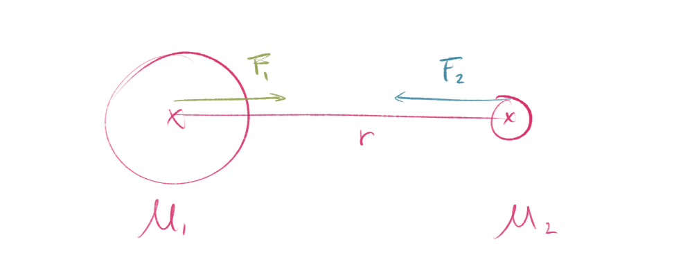

## Wiederholung 6. Klasse:

Newton hat die Erste Vereinheitlichung in Physik vollzogen, nämlich die zwischen Bewegung der Himmelskörper und von körper an der Erdobefläche.  
_Vereinheitlichung: von 2 oder mehrere zu einen zusammenfassen._

## Gedankenexperiment

Angenommen eine Riese wirft auf einem hohen Berg Steine mit hoher Geschwindigkeit $\rightarrow$ je größer die Geschwindigkeit desto weiter der Stein auf der Erdoberfläche auf $\rightarrow$ trifft die Erde aber (fast) an ihrem Kegel vorbei, krümmt sich gleichsam die Erdoberfläche der Bahn weg $\rightarrow$ ab einer bestimmten Geschwindigkeit umkreist der Stein die Erde.

## Das Newton'sche Gravitationsgesetz

Newton hat eine Formel gefunden, mit dem man die Gravitation (Kraft) zwischen min. 2 und mehreren Massen berechnen kann, die sich in einem bestimmten Abstand zueinander befinden.

z.B. 2 Planeten:

$$
F_G = G \frac{m_1 m_2}{r^2}
$$

$F_G \dots$ Gravitationskraft  
$G \approx 6.674 \times 10^{-11} \text{ N}\cdot\text{m}^2/\text{kg}^2 \dots$ Gravitationskonstante  
$m_1, m_2 \dots$ Massen von Objekten (hier: Planeten)  
$r \dots$ Distanz zwischen den Massenmittelpunkten

*Im Formel steht $r^2$ weil die Oberfläche einer Kugel $O_{Kugel}=4 \pi r^2$. Wenn du den Abstand $r$ verdoppelst, vervierfacht sich die Fläche ($2^2 = 4$). Daher verteilt sich die Kraft auf die vierfache Fläche, was bedeutet, dass sie an jedem einzelnen Punkt nur noch ein Viertel so stark ist.*
