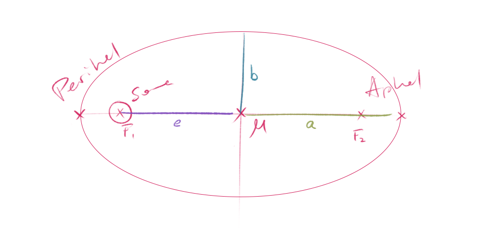
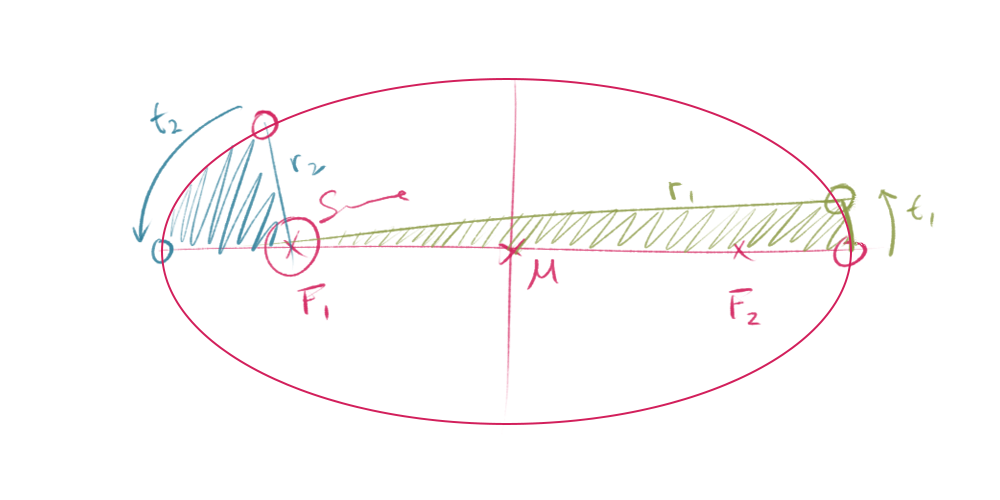
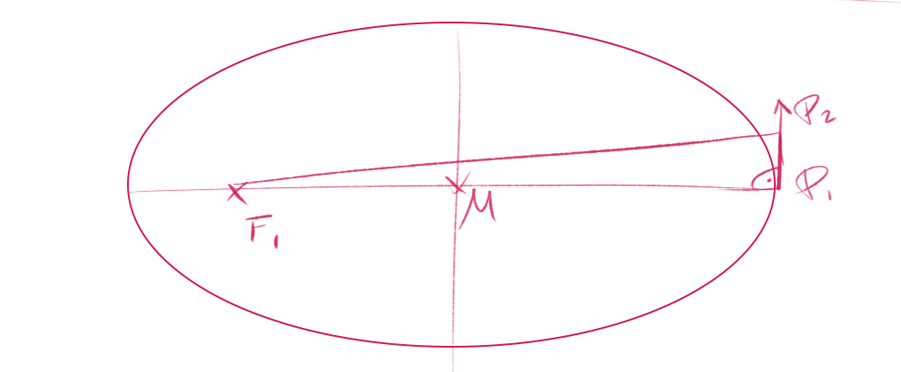

Kepler machte drei wesentliche Entdeckungen zur Planetenmechanik,  
konnte jedoch keine physikalische Erklärung dafür liefern.  

Erst Newton konnte im Rahmen seiner klassischen Mechanik bzw. seiner
klassischen Gravitationstheorie eine physikalische Erklärung geben
und das zweite sowie das dritte Keplersche Gesetz herleiten.  

## 1. Keplersches Gesetz

**Die Planeten bewegen sich auf Ellipsenbahnen, in deren einem Brennpunkt die Sonne steht.**

Größte Selbstverständlichkeit ist ohne nachzudenken.  
Leute von früher sind ausgegangen dass Planetenbahnen Kreisbahnen sind.

  

Aphel: sonnenfernster Punkt  
Perihel: sonnennächster Punkt  
$a \dots$ große Halbachse  
$b \dots$ kleine Halbachse  
$e \dots$ Exzentrizität  

*(Exzentrizität ist eine Bestimmungsgröße für Ellipsen. Sie gibt das Ausmaß der Abweichung
der Ellipsenform von der Kreisform an:  
Je größer die Exzentrizität, desto stärker ist die Ellipse ausgeprägt)*

## 2. Keplersches Gesetz

**Der von der Sonne zum Planeten zeigende Radiusvektor $r$ überstreicht
in gleichen Zeiten gleiche Flächen.**

$$ 
\frac{\Delta A_1}{\Delta t_1} = \frac{\Delta A_2}{\Delta t_2}
$$

$\Delta A_1$, $\Delta A_2 \dots$ überstrichene Flächen  
$\Delta t_1$, $\Delta t_2 \dots$ Zeitspannen  

also: Wenn $\Delta t_1 = \Delta t_2$, dann gilt $\Delta A_1 = \Delta A_2$.  

$L \dots$ Drehimpuls

$$
L = m \cdot v \cdot r = \text{const}
$$

Der Drehimpuls eines Planeten ist konstant.  

Wenn wir die Bewegung des Planeten nur über eine kurze Zeit betrachten,
können wir annehmen, dass die Geschwindigkeit des Planeten konstant bleibt
($v = \text{const}$)  
und dass der Planet anstatt einer Ellipsenbahn eine gerade Strecke zurücklegt.

  

Wenn $v = \text{const}$ gilt:

$$
v = \frac{s}{t}
$$

$s/t$ anstelle von $v$ einsetzen:

$$
L = m \cdot \frac{s}{t} \cdot r
$$

oder

$$
L = \frac{m \cdot r \cdot s}{t}
$$

wobei $P_1$, $P_2$ und $F_1$ ein rechtwinkliges Dreieck mit dem Flächeninhalt bilden:

$$
A_\triangle = \frac{r \cdot s}{2}
$$

Umformen:

$$ 
r \cdot s = 2A_\triangle
$$

Einsetzen in $L$:

$$
L = m \cdot \frac{2A_\triangle}{t} = \text{const}
$$

Nach $A_\triangle / t$ umformen:

$$
\frac{A_\triangle}{t} = \frac{L}{2m} = \text{const}
$$

also:

$$
\frac{A_1}{t_1} = \frac{A_2}{t_2} = \frac{L}{2m} = \text{const}
$$

*Kepler kannte die Daten, aber nicht den physikalischen Zusammenhang.*

## 3. Keplersches Gesetz

**Die Quadrate der Umlaufzeiten $T_1, T_2$ zweier Planeten verhalten sich
wie die dritten Potenzen der großen Halbachsen $a_1, a_2$
ihrer Bahnellipsen.**

$$
\frac{{T_1}^2}{{a_1}^3} =
\frac{{T_2}^2}{{a_2}^3} =
\frac{{T_3}^2}{{a_3}^3} =
\dots =
\frac{{T_8}^2}{{a_8}^3} = \text{const}
$$

*(8 für unser Sonnensystem)*

Wir gehen von einer vereinfachten Annahme aus:  
**Die Planetenbahn ist eine Kreisbahn mit festem Radius $r$.**
