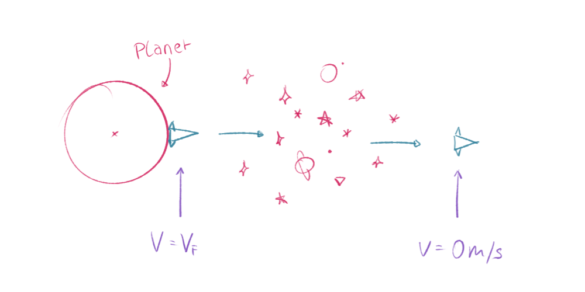
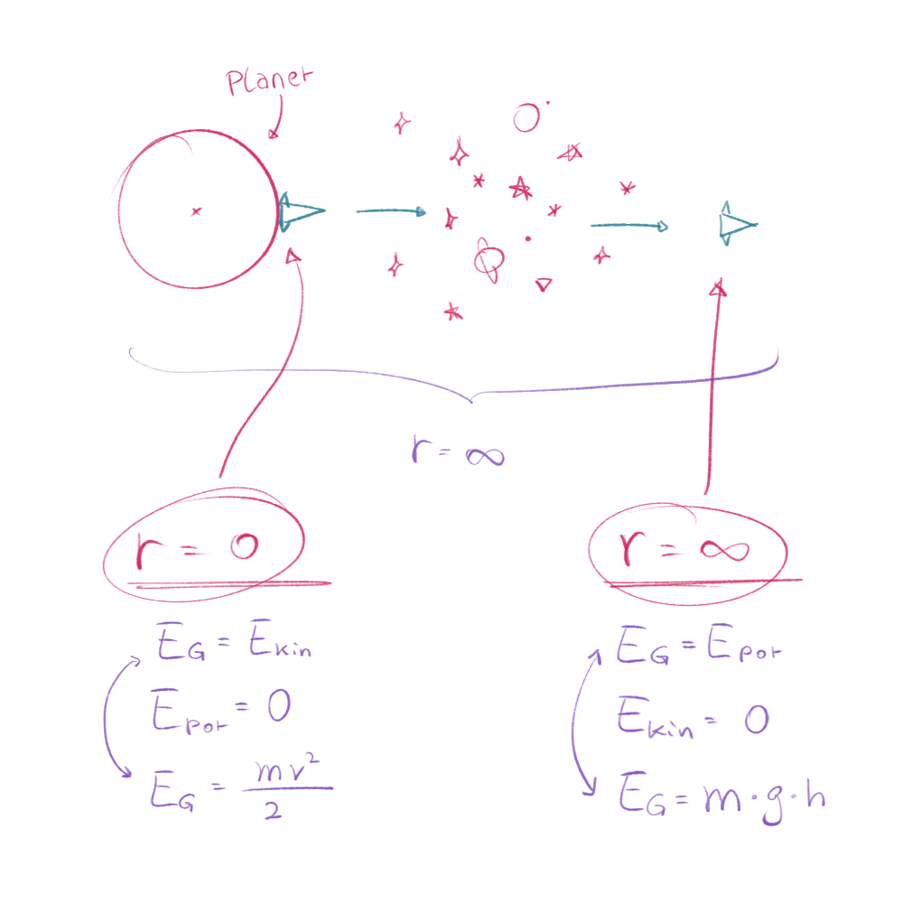

## Definition
Ein Körper, der mit **Fluchtgeschwindigkeit $v_F$** die Oberfläche eines Planeten verlässt *(z.B. das Raumschiff von Jules Verne)*, fällt nie mehr von selbst auf die Erde zurück  

## Genaue Definition
Startet ein Raumschiff mit exakt Fluchtgeschwindigkeit, so erreicht es nach unendlich langer Zeit in unendlich weiter Entfernung die Geschwindigkeit von exakt $0\,\text{m/s}$  

  

## Beschreibung der komplexen Dynamik

**Es wird immer langsamer langsamer**:  
Je weiter sich das Raumschiff vom Planeten entfernt, umso mehr abgebremst wird es durch die Gravitation  $\rightarrow$ ==Diese Gravitationskraft nimmt jedoch mit zunehmender Entfernung zum Planeten ab== $\rightarrow$ deshalb nimmt auch der Wert der Abbremsung ab, das heißt die negative Beschleunigung wird immer geringer, je weiter sich das Raumschiff vom Planeten entfernt.  

## Herleitung der Formel

WH. 6. Klasse:  

Gesamtenergie *($E_G$)* = Kinetische Energie *($E_{kin}$)* + Potentielle energie *($E_{pot}$)*

$$E_G = E_{kin} + E_{pot}$$ 

also

$$E_G = \left( \frac{m \cdot v^2}{2} \right) + (m \cdot g \cdot h)$$ 

$m \dots$ Masse d. Raumschiffs  
$h \dots$ Höhe  
$g \dots$ Erdbeschleunigung $\approx 9,81\,\text{m/s}^2$ *(an der Erdoberfläche)*   

  

### Beobachtung an "Extremdistanzen"

Für die "Extremdistanzen" *($r=0$ und $r \rightarrow \infty$)* gilt $E_{kin} = E_{pot}$

**Am Startpunkt** *($r=0$)*:  
Das Raumschiff startet mit maximale kinetische Energie,  
und *(theoretisch)* $E_{pot} = 0$  

Es gilt für $E_G$

$$E_G = E_{kin} = \frac{m \cdot v_F^2}{2}$$  

 

**Im Unendlichen** *($r \rightarrow \infty$)*:  
Das Raumschiff kommt zum Stillstand  
Geschwindigkeit $v = E_{kin} =  0$

Es gilt für $E_G$  

$$E_G = E_{pot} =  m \cdot g \cdot h$$  

**Gleichsetzen**:  
Da die Gesamtenergie erhalten bleibt, gilt:

$$\frac{m \cdot v_F^2}{2} = m \cdot g \cdot h$$

**Kürzen und Umformen**:  

$$v_F^2 = 2 \cdot g \cdot h$$

Unter Berücksichtigung von $g = \frac{G \cdot M}{r^2}$ *(wobei $M$ die Masse d. Planeten ist)* und der Annahme $h = r$ *(Radius des Planeten)*:

$$v_F^2 = 2 \cdot \frac{G \cdot M}{r^2} \cdot h = 2 \cdot \frac{G \cdot M}{r^2} \cdot r$$

$$v_F^2 = \frac{2 \cdot G \cdot M}{r}$$

Also

$$v_F = \sqrt{\frac{2 \cdot G \cdot M}{r}}$$

 

*LETS GOOOOO*

