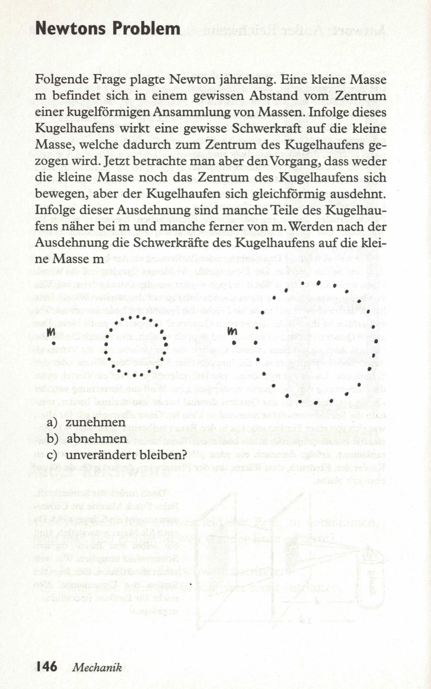
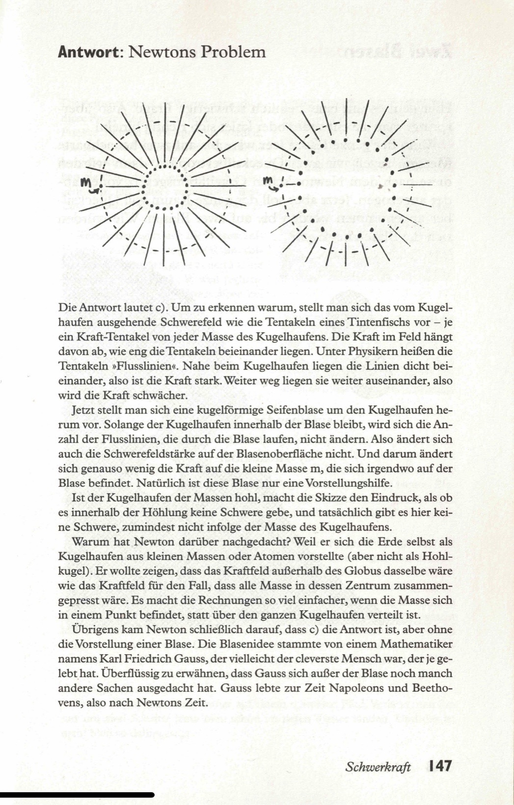

Folgende Frage plagte Newton jahrelang. Eine kleine Masse m befindet sich in einem gewissen Abstand vom Zentrum einer kugelförmigen Ansammlung von Massen. Infolge dieses Kugelhaufens wirkt eine gewisse Schwerkraft auf die kleine Masse, welche dadurch zum Zentrum des Kugelhaufens gezogen wird. Jetzt betrachte man aber den Vorgang, dass weder die kleine Masse noch das Zentrum des Kugelhaufens sich bewegen, aber der Kugelhaufen sich gleichförmig ausdehnt. Infolge dieser Ausdehnung sind manche Teile des Kugelhaufens näher bei m und manche ferner von m. Werden nach der Ausdehnung die Schwerkräfte des Kugelhaufens auf die kleine Masse m

a) zunehmen  
b) abnehmen  
c) unverändert bleiben?  

<spoiler box title="Antwort">
Die Antwort lautet c). Um zu erkennen warum, stellt man sich das vom Kugelhaufen ausgehende Schwerefeld wie die Tentakeln eines Tintenfischs vor – je ein Kraft-Tentakel von jeder Masse des Kugelhaufens. Die Kraft im Feld hängt davon ab, wie eng die Tentakeln beieinander liegen. Unter Physikern heißen die Tentakeln »Flusslinien«. Nahe beim Kugelhaufen liegen die Linien dicht beieinander, also ist die Kraft stark. Weiter weg liegen sie weiter auseinander, also wird die Kraft schwächer.

Jetzt stellt man sich eine kugelförmige Seifenblase um den Kugelhaufen herum vor. Solange der Kugelhaufen innerhalb der Blase bleibt, wird sich die Anzahl der Flusslinien, die durch die Blase laufen, nicht ändern. Also ändert sich auch die _Schwerefeldstärke_ auf der Blasenoberfläche nicht. Und darum ändert sich genauso wenig die Kraft auf die kleine Masse m, die sich irgendwo auf der Blase befindet. Natürlich ist diese Blase nur eine Vorstellungshilfe.

Ist der Kugelhaufen der Massen hohl, macht die Skizze den Eindruck, als ob es innerhalb der Höhlung keine Schwere gebe, und tatsächlich gibt es hier keine Schwere, _zumindest nicht infolge der Masse des Kugelhaufens._

Warum hat Newton darüber nachgedacht? Weil er sich die Erde selbst als Kugelhaufen aus kleinen Massen oder Atomen vorstellte (aber nicht als Hohlkugel). Er wollte zeigen, dass das Kraftfeld außerhalb des Globus dasselbe wäre wie das Kraftfeld für den Fall, dass alle Masse in dessen Zentrum zusammengepresst wäre. Es macht die Rechnungen so viel einfacher, wenn die Masse sich in einem Punkt befindet, statt über den ganzen Kugelhaufen verteilt ist.

Übrigens kam Newton schließlich darauf, dass c) die Antwort ist, aber ohne die Vorstellung einer Blase. Die Blasenidee stammte von einem Mathematiker namens Karl Friedrich Gauss, der vielleicht der cleverste Mensch war, der je gelebt hat. Überflüssig zu erwähnen, dass Gauss sich außer der Blase noch manch andere Sachen ausgedacht hat. Gauss lebte zur Zeit Napoleons und Beethovens, also nach Newtons Zeit.
</spoiler>  

Quelle: Epstein, L. C., Denksport Physik

