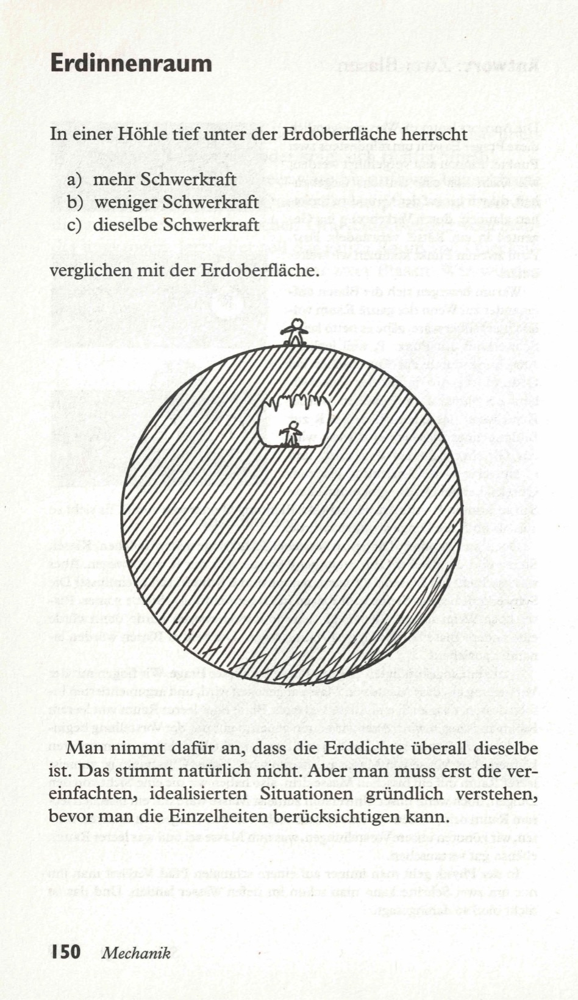
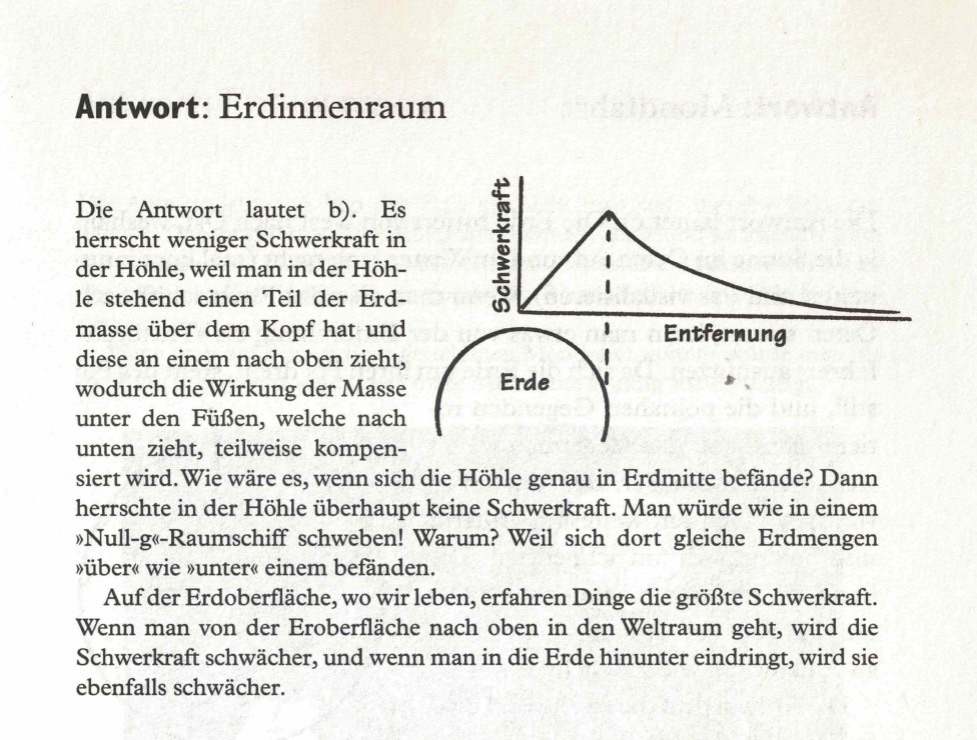

In einer Höhle tief unter der Oberfläche der Erde gibt es  

a) mehr Schwerkraft als auf der Oberfläche der Erde  
b) weniger Schwerkraft als auf der Oberfläche der Erde  
c) die gleiche Schwerkraft wie auf der Oberfläche der Erde  

<spoiler box title="Antwort">
Die Antwort lautet b). Es herrscht weniger Schwerkraft in der Höhle, weil man in der Höhle stehend einen Teil der Erdmasse über dem Kopf hat und diese an einem nach oben zieht, wodurch die Wirkung der Masse unter den Füßen, welche nach unten zieht, teilweise kompensiert wird. Wie wäre es, wenn sich die Höhle genau in Erdmitte befände? Dann herrschte in der Höhle überhaupt keine Schwerkraft. Man würde wie in einem »Null-g«-Raumschiff schweben! Warum? Weil sich dort gleiche Erdmengen »über« wie »unter« einem befänden.

Auf der Erdoberfläche, wo wir leben, erfahren Dinge die größte Schwerkraft. Wenn man von der Eroberfläche nach oben in den Weltraum geht, wird die Schwerkraft schwächer, und wenn man in die Erde hinunter eindringt, wird sie ebenfalls schwächer.
</spoiler>

Quelle: Epstein, L. C., Denksport Physik

