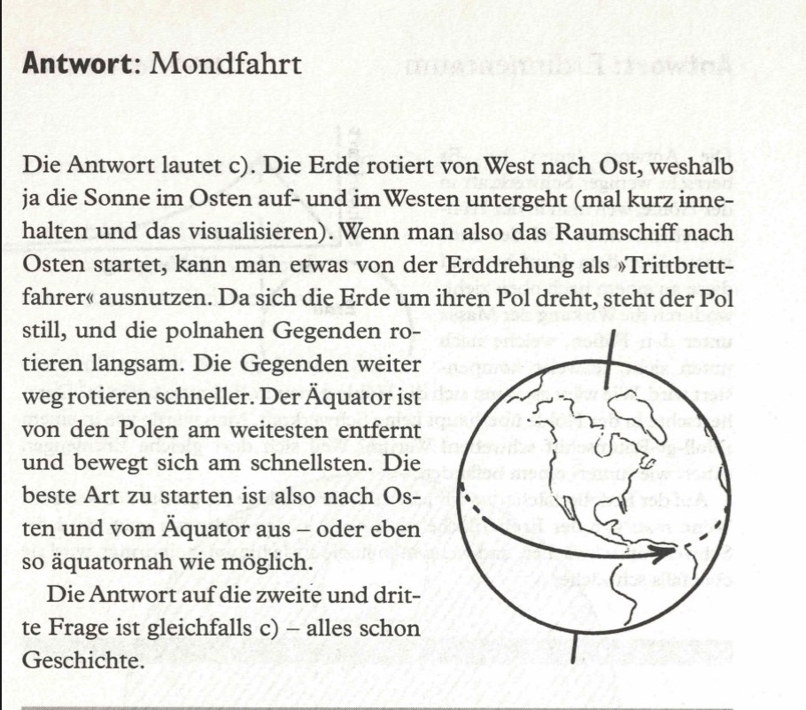

Von welchem der fünf aufgeführten Orte könnte ein Raumschiff am leichtesten gestartet werden?  

a) New Mexico (nach Süden über Mexiko)  
b) Kalifornien (nach Norden über den Pazifischen Ozean)  
c) Florida (nach Osten über den Atlantik)  
d) Moskau (nach Osten über Sibirien)  

<spoiler box title="Antwort">
Die Antwort lautet c). Die Erde rotiert von West nach Ost, weshalb ja die Sonne im Osten auf- und im Westen untergeht (mal kurz innehalten und das visualisieren). Wenn man also das Raumschiff nach Osten startet, kann man etwas von der Erddrehung als »Trittbrettfahrer« ausnutzen. Da sich die Erde um ihren Pol dreht, steht der Pol still, und die polnahen Gegenden rotieren langsam. Die Gegenden weiter weg rotieren schneller. Der Äquator ist von den Polen am weitesten entfernt und bewegt sich am schnellsten. Die beste Art zu starten ist also nach Osten und vom Äquator aus - oder eben so äquatornah wie möglich.

Die Antwort auf die zweite und dritte Frage ist gleichfalls c) - alles schon Geschichte.
</spoiler>

Quelle: Epstein, L. C., Denksport Physik

