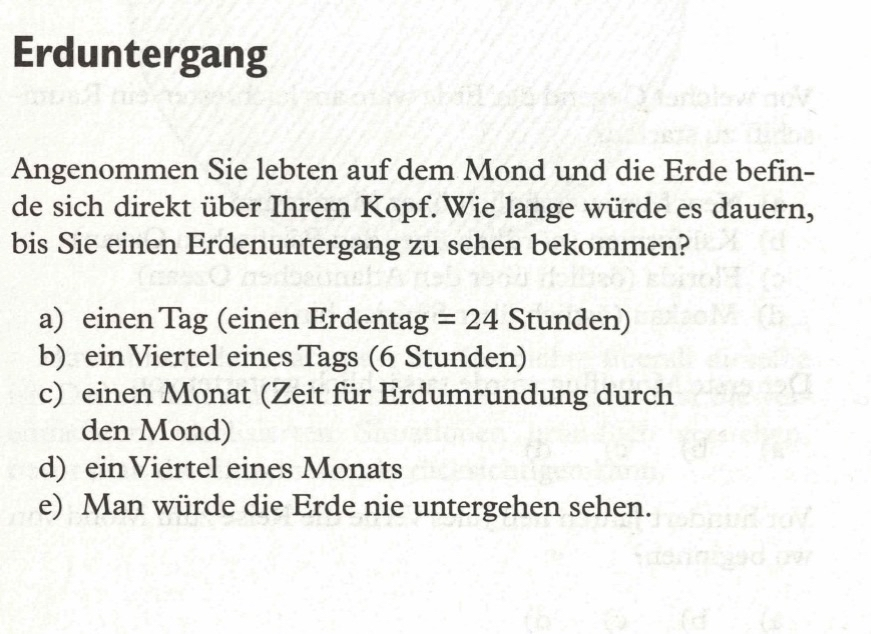
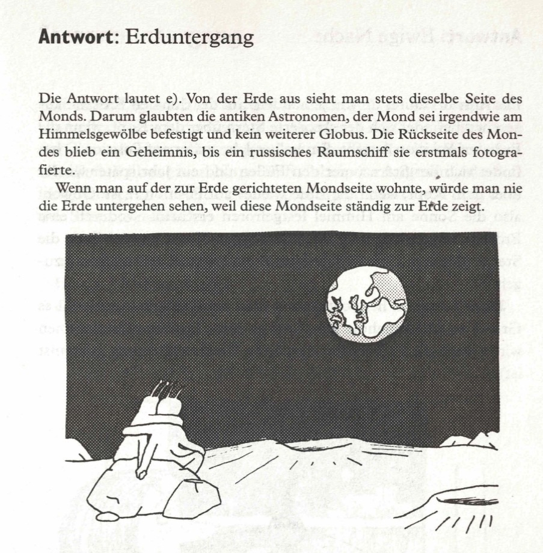

Angenommen, Sie lebten auf dem Mond. Wenn die Erde direkt über Ihrem Kopf stünde, wie lange würde es dann dauern, bevor Sie den Erduntergang sehen könnten?  

a) einen Tag (Erdtag, 24 Stunden)  
b) einen Vierteltag (6 Stunden)  
c) einen Monat (die Zeit, die der Mond benötigt, um einmal die Erde zu umkreisen)  
d) einen Viertelmonat  
e) Man könnte die Erde niemals untergehen sehen.  

<spoiler box title="Antwort">
Die Antwort lautet e). Von der Erde aus sieht man stets dieselbe Seite des Monds. Darum glaubten die antiken Astronomen, der Mond sei irgendwie am Himmelsgewölbe befestigt und kein weiterer Globus. Die Rückseite des Mondes blieb ein Geheimnis, bis ein russisches Raumschiff sie erstmals fotografierte.

Wenn man auf der zur Erde gerichteten Mondseite wohnte, würde man nie die Erde untergehen sehen, weil diese Mondseite ständig zur Erde zeigt.
</spoiler>

Quelle: Epstein, L. C., Denksport Physik

