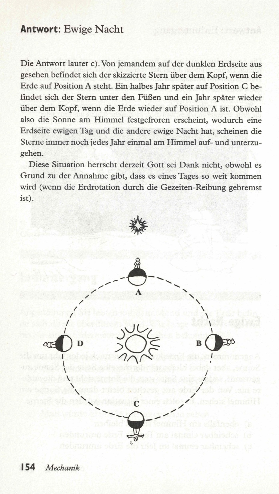

Wir wollen jetzt annehmen, daß die Erde immer noch einmal im Jahr die Sonne umkreist, aber eine Seite der Erde immer auf die Sonne gerichtet ist, so daß die eine Seite die Sonne immer sieht, während sie die andere Seite niemals zu Gesicht bekommt. Von der Erde sieht es dann so aus, als ob die Sonne am Himmel steht. In dieser angenommenen Situation würden die Sterne  

a) ebenfalls stationär im Himmel erscheinen  
b) einmal am Tag die Erde zu umkreisen scheinen  
c) einmal im Jahr die Erde zu umkreisen scheinen  

<spoiler box title="Antwort">
Die Antwort lautet c). Von jemandem auf der dunklen Erdseite aus gesehen befindet sich der skizzierte Stern über dem Kopf, wenn die Erde auf Position A steht. Ein halbes Jahr später auf Position C befindet sich der Stern unter den Füßen und ein Jahr später wieder über dem Kopf, wenn die Erde wieder auf Position A ist. Obwohl also die Sonne am Himmel festgefroren erscheint, wodurch eine Erdseite ewigen Tag und die andere ewige Nacht hat, scheinen die Sterne immer noch jedes Jahr einmal am Himmel auf- und unterzugehen.

Diese Situation herrscht derzeit Gott sei Dank nicht, obwohl es Grund zu der Annahme gibt, dass es eines Tages so weit kommen wird (wenn die Erdrotation durch die Gezeiten-Reibung gebremst ist).
</spoiler>

Quelle: Epstein, L. C., Denksport Physik

