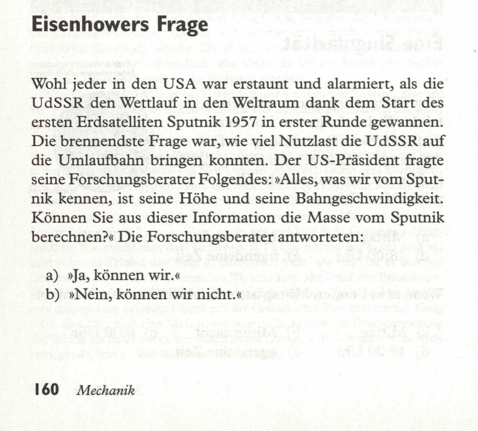
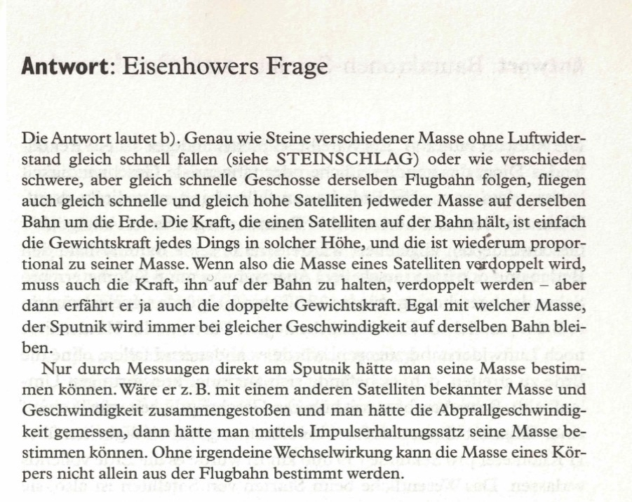

Praktisch jeder Einwohner der USA war erstaunt und beunruhigt, als die UdSSR die erste Runde des Weltraumwettlaufs mit dem Start des ersten Erdsatelliten Sputnik im Jahre 1957 gewann. Die wichtigste Frage war die Masse der Nutzlast (Raumschiff), die die UdSSR in Umlauf bringen konnte. Genau das war die Frage, die der Präsident der Vereinigten Staaten seinen wissenschaftlichen Ratgebern stellte: „Alles, was wir sicher über den Sputnik wissen, sind Höhe und Umlaufgeschwindigkeit. Können Sie aus diesen Informationen die Masse von Sputnik berechnen?“ Die wissenschaftlichen Ratgeber antworteten:  

a) „Ja, das können wir.“  
b) „Nein, das können wir nicht.“  

<spoiler box title="Antwort">
Die Antwort lautet b). Genau wie Steine verschiedener Masse ohne Luftwiderstand gleich schnell fallen (siehe STEINSCHLAG) oder wie verschieden schwere, aber gleich schnelle Geschosse derselben Flugbahn folgen, fliegen auch gleich schnelle und gleich hohe Satelliten jedweder Masse auf derselben Bahn um die Erde. Die Kraft, die einen Satelliten auf der Bahn hält, ist einfach die Gewichtskraft jedes Dings in solcher Höhe, und die ist wiederum proportional zu seiner Masse. Wenn also die Masse eines Satelliten verdoppelt wird, muss auch die Kraft, ihn auf der Bahn zu halten, verdoppelt werden - aber dann erfährt er ja auch die doppelte Gewichtskraft. Egal mit welcher Masse, der Sputnik wird immer bei gleicher Geschwindigkeit auf derselben Bahn bleiben.

Nur durch Messungen direkt am Sputnik hätte man seine Masse bestimmen können. Wäre er z.B. mit einem anderen Satelliten bekannter Masse und Geschwindigkeit zusammengestoßen und man hätte die Abprallgeschwindigkeit gemessen, dann hätte man mittels Impulserhaltungssatz seine Masse bestimmen können. Ohne irgendeine Wechselwirkung kann die Masse eines Körpers nicht allein aus der Flugbahn bestimmt werden.
</spoiler>

Quelle: Epstein, L. C., Denksport Physik

