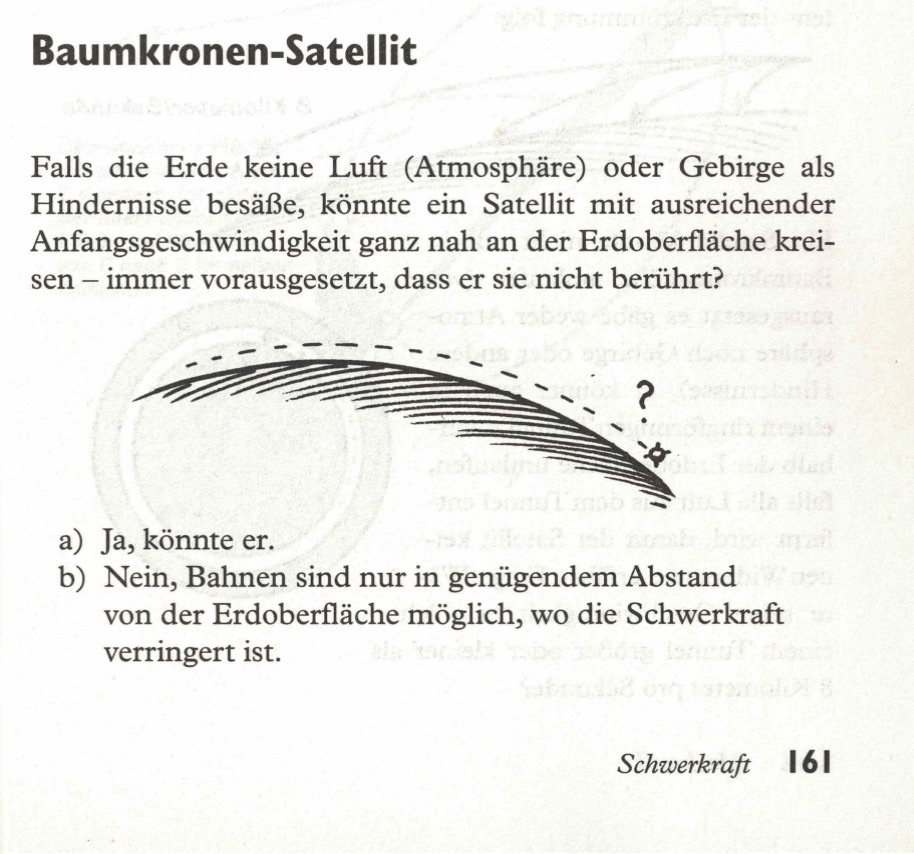
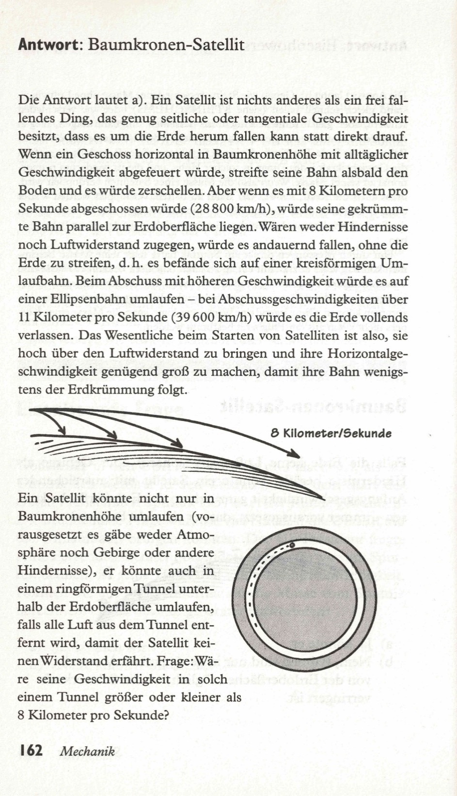

Wenn die Erde keine Luft (Atmosphäre) oder störende Berge hätte, könnte ein Satellit mit entsprechender Anfangsgeschwindigkeit beliebig dicht zur Erdoberfläche umlaufen - unter der Voraussetzung, daß er sie nicht berührt.  

a) Ja, das wäre möglich.  
b) Nein, Umlaufbahnen sind nur in einem ausreichenden Abstand über der Erdoberfläche möglich, wo die Gravitation reduziert ist.  

<spoiler box title="Antwort">
Die Antwort lautet a). Ein Satellit ist nichts anderes als ein frei fallendes Ding, das genug seitliche oder tangentiale Geschwindigkeit besitzt, dass es um die Erde herum fallen kann statt direkt drauf. Wenn ein Geschoss horizontal in Baumkronenhöhe mit alltäglicher Geschwindigkeit abgefeuert würde, streifte seine Bahn alsbald den Boden und es würde zerschellen. Aber wenn es mit 8 Kilometern pro Sekunde abgeschossen würde (28 800 km/h), würde seine gekrümmte Bahn parallel zur Erdoberfläche liegen. Wären weder Hindernisse noch Luftwiderstand zugegen, würde es andauernd fallen, ohne die Erde zu streifen, d.h. es befände sich auf einer kreisförmigen Umlaufbahn. Beim Abschuss mit höheren Geschwindigkeit würde es auf einer Ellipsenbahn umlaufen - bei Abschussgeschwindigkeiten über 11 Kilometer pro Sekunde (39 600 km/h) würde es die Erde vollends verlassen. Das Wesentliche beim Starten von Satelliten ist also, sie hoch über den Luftwiderstand zu bringen und ihre Horizontalgeschwindigkeit genügend groß zu machen, damit ihre Bahn wenigstens der Erdkrümmung folgt.

Ein Satellit könnte nicht nur in Baumkronenhöhe umlaufen (vorausgesetzt es gäbe weder Atmosphäre noch Gebirge oder andere Hindernisse), er könnte auch in einem ringförmigen Tunnel unterhalb der Erdoberfläche umlaufen, falls alle Luft aus dem Tunnel entfernt wird, damit der Satellit keinen Widerstand erfährt. Frage: Wäre seine Geschwindigkeit in solch einem Tunnel größer oder kleiner als 8 Kilometer pro Sekunde?
</spoiler>

Quelle: Epstein, L. C., Denksport Physik

