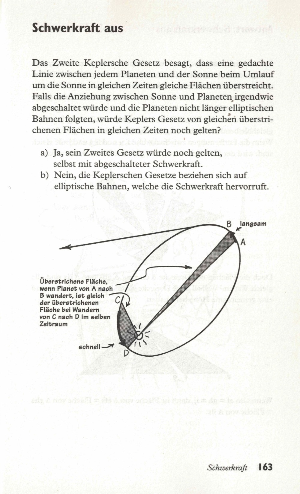
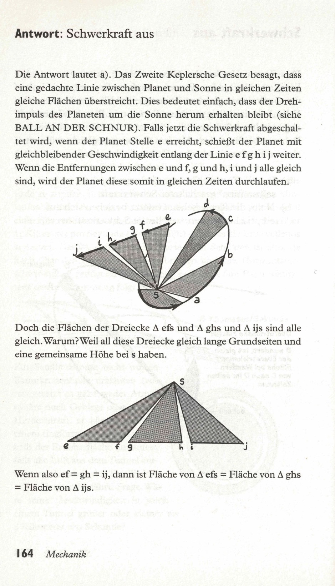

Das zweite Keplersche Gesetz besagt, daß eine imaginäre Linie zwischen einem Planeten und der Sonne gleiche Flächen in gleichen Zeiten während des Umlaufs um die Sonne überstreicht. Wenn die Gravitation zwischen der Sonne und dem Planeten irgendwie abgeschaltet würde und die Planeten nicht länger auf elliptischen Bahnen fliegen würden, würde dann das oben genannte Keplersche Gesetz immer noch zutreffen?  

a) Ja, das zweite Gesetz würde immer noch gelten, auch wenn die Gravitation abgeschaltet worden wäre.  
b) Nein, die Keplerschen Gesetze beziehen sich auf die von der Gravitation erzeugten elliptischen Umlaufbahnen. Wenn die Gravitation abgeschaltet ist, ist das zweite Keplersche Gesetz bedeutungslos.  

<spoiler box title="Antwort">
Die Antwort lautet a). Das Zweite Keplersche Gesetz besagt, dass eine gedachte Linie zwischen Planet und Sonne in gleichen Zeiten gleiche Flächen überstreicht. Dies bedeutet einfach, dass der Drehimpuls des Planeten um die Sonne herum erhalten bleibt (siehe BALL AN DER SCHNUR). Falls jetzt die Schwerkraft abgeschaltet wird, wenn der Planet Stelle e erreicht, schießt der Planet mit gleichbleibender Geschwindigkeit entlang der Linie e f g h i j weiter. Wenn die Entfernungen zwischen e und f, g und h, i und j alle gleich sind, wird der Planet diese somit in gleichen Zeiten durchlaufen.

Doch die Flächen der Dreiecke $\Delta$ efs und $\Delta$ ghs und $\Delta$ ijs sind alle gleich. Warum? Weil all diese Dreiecke gleich lange Grundseiten und eine gemeinsame Höhe bei s haben.

Wenn also ef = gh = ij, dann ist Fläche von $\Delta$ efs = Fläche von $\Delta$ ghs = Fläche von $\Delta$ ijs.
</spoiler>

Quelle: Epstein, L. C., Denksport Physik

