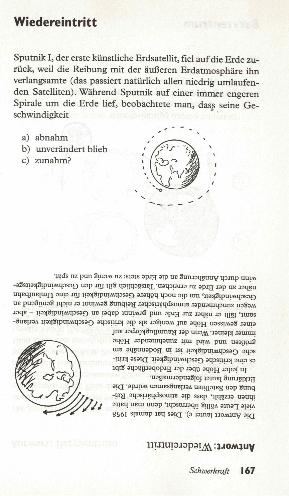

Sputnik I, der künstliche Erdsatellit, fiel auf die Erde zurück, weil die reibung im äußeren Teil der Erdatmosphäre ihn verlangsamte. (Natürlich geschieht dies mit allen Raumschiffen auf niedrigen Umlaufbahnen.) Während Sputnik auf immer engeren Spiralbahnen die Erde umlief, beobachtete man, daß seine Geschwindigkeit  

a) abnahm  
b) gleich blieb  
c) anstieg  

<spoiler box title="Antwort">
Die Antwort lautet c). Dies hat damals 1958 viele Leute völlig überrascht, denn man hatte ihnen erzählt, dass die atmosphärische Reibung den Satelliten verlangsamen würde. Die Erklärung lautet folgendermaßen.

In jeder Höhe über der Erdoberfläche gibt es eine kritische Geschwindigkeit. Diese kritische Geschwindigkeit ist in Bodennähe am größten und wird mit zunehmender Höhe immer kleiner. Wenn der Raumflugkörper auf einer gewissen Höhe auf weniger als die kritische Geschwindigkeit verlangsamt, fällt er näher zur Erde und gewinnt dabei an Geschwindigkeit - aber wegen zunehmender atmosphärischer Reibung gewinnt er nicht genügend an Geschwindigkeit, um die noch höhere Geschwindigkeit für eine Umlaufbahn näher an der Erde zu erreichen. Tatsächlich gilt für den Geschwindigkeitsgewinn durch Annäherung an die Erde stets: zu wenig und zu spät.
</spoiler>

Quelle: Epstein, L. C., Denksport Physik

