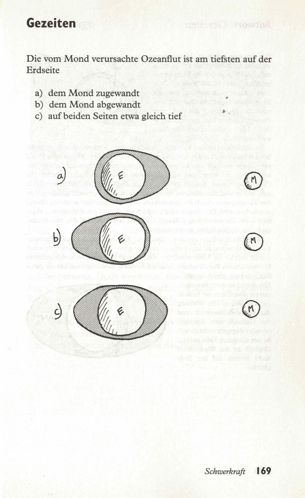
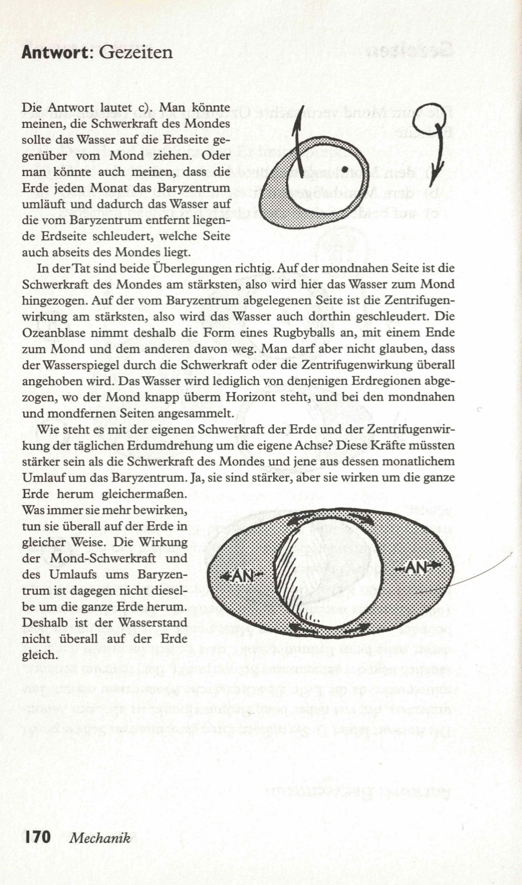

Auf welcher Seite der Erde ist die vom Mond erzeugte Flut am tiefsten?  

a) auf der mondzugewandten Seite  
b) auf der mondabgewandten Seite  
c) auf beiden Seiten etwa gleich tief  

<spoiler box title="Antwort">
Die Antwort lautet c). Man könnte meinen, die Schwerkraft des Mondes sollte das Wasser auf die Erdseite gegenüber vom Mond ziehen. Oder man könnte auch meinen, dass die Erde jeden Monat das Baryzentrum umläuft und dadurch das Wasser auf die vom Baryzentrum entfernt liegende Erdseite schleudert, welche Seite auch abseits des Mondes liegt.

In der Tat sind beide Überlegungen richtig. Auf der mondnahen Seite ist die Schwerkraft des Mondes am stärksten, also wird hier das Wasser zum Mond hingezogen. Auf der vom Baryzentrum abgelegenen Seite ist die Zentrifugenwirkung am stärksten, also wird das Wasser auch dorthin geschleudert. Die Ozeanblase nimmt deshalb die Form eines Rugbyballs an, mit einem Ende zum Mond und dem anderen davon weg. Man darf aber nicht glauben, dass der Wasserspiegel durch die Schwerkraft oder die Zentrifugenwirkung überall angehoben wird. Das Wasser wird lediglich von denjenigen Erdregionen abgezogen, wo der Mond knapp überm Horizont steht, und bei den mondnahen und mondfernen Seiten angesammelt.

Wie steht es mit der eigenen Schwerkraft der Erde und der Zentrifugenwirkung der täglichen Erdumdrehung um die eigene Achse? Diese Kräfte müssten stärker sein als die Schwerkraft des Mondes und jene aus dessen monatlichem Umlauf um das Baryzentrum. Ja, sie sind stärker, aber sie wirken um die ganze Erde herum gleichermaßen. Was immer sie mehr bewirken, tun sie überall auf der Erde in gleicher Weise. Die Wirkung der Mond-Schwerkraft und des Umlaufs ums Baryzentrum ist dagegen nicht dieselbe um die ganze Erde herum. Deshalb ist der Wasserstand nicht überall auf der Erde gleich.
</spoiler>

Quelle: Epstein, L. C., Denksport Physik

