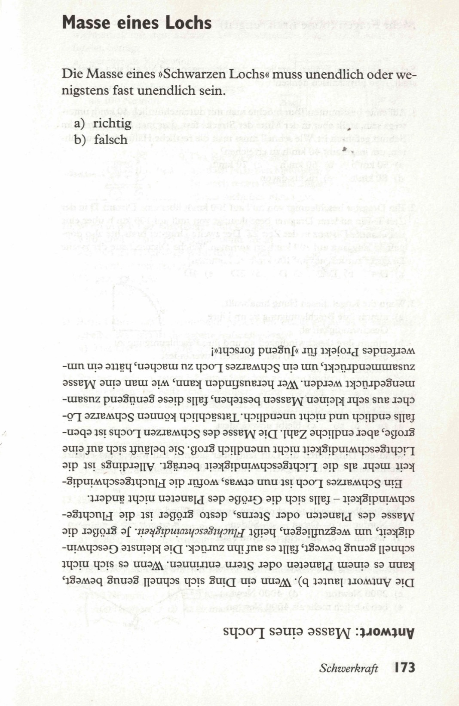

Die Masse eines „schwarzen Lochs“ muß unendlich sein oder zumindest fast unendlich.  

a) richtig  
b) falsch  

<spoiler box title="Antwort">
Die Antwort lautet b). Wenn ein Ding sich schnell genug bewegt, kann es einem Planeten oder Stern entrinnen. Wenn es sich nicht schnell genug bewegt, fällt es auf ihn zurück. Die kleinste Geschwindigkeit, um wegzufliegen, heißt Fluchtgeschwindigkeit. Je größer die Masse des Planeten oder Sterns, desto größer ist die Fluchtgeschwindigkeit - falls sich die Größe des Planeten nicht ändert.

Ein Schwarzes Loch ist nun etwas, wofür die Fluchtgeschwindigkeit mehr als die Lichtgeschwindigkeit beträgt. Allerdings ist die Lichtgeschwindigkeit nicht unendlich groß. Sie beläuft sich auf eine große, aber endliche Zahl. Die Masse des Schwarzen Lochs ist ebenfalls endlich und nicht unendlich. Tatsächlich können Schwarze Löcher aus sehr kleinen Massen bestehen, falls diese genügend zusammengedrückt werden. Wer herausfinden kann, wie man eine Masse zusammendrückt, um ein Schwarzes Loch zu machen, hätte ein umwerfendes Projekt für »Jugend forscht«!
</spoiler>

Quelle: Epstein, L. C., Denksport Physik

